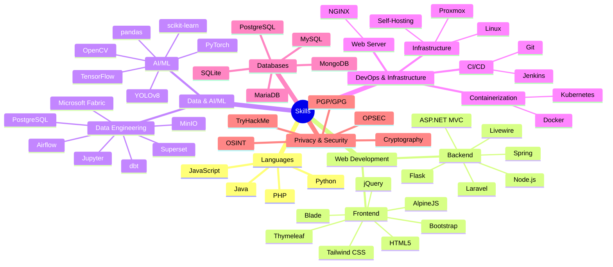

```
                                                                                              ╱|、
                                                                                            (˚ˎ 。7
                                                                                             |、˜〵
                                                                                             じしˍ,)ノ
```

